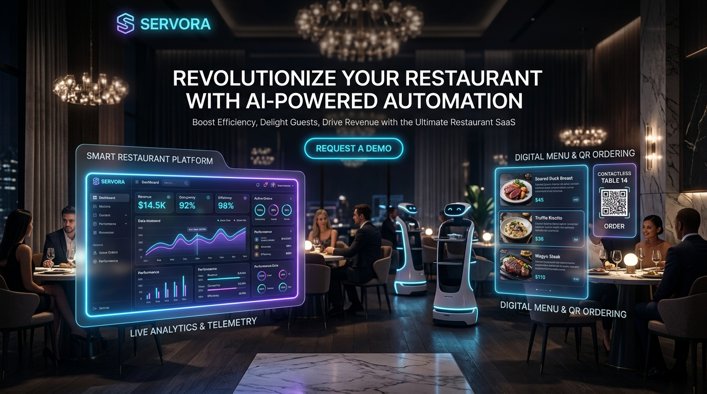
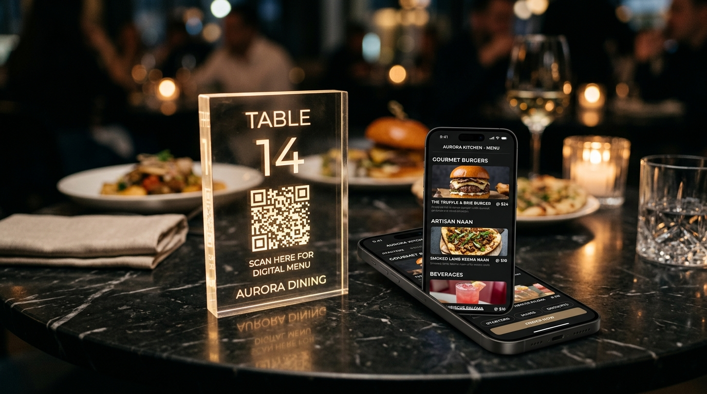
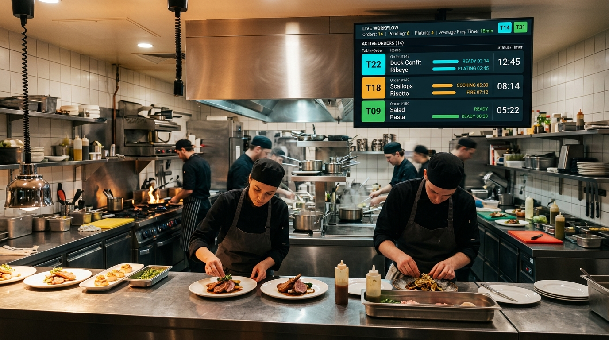
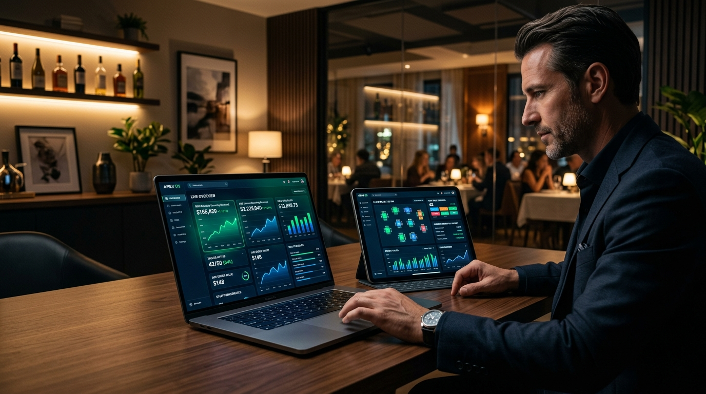

# 🍽️ Servora Client — Next-Gen Autonomous Restaurant Frontend

<div align="center">



[](https://vitejs.dev/)
[](https://reactjs.org/)
[](https://supabase.com/)
[](https://tailwindcss.com/)

</div>

---

## 🚀 Key Client Modules

### 1. Customer QR Menu & Table Ordering (`/menu/:restaurantId`)
- **Physics-Based Draggable Cart**: Smooth touch-drag floating action button.
- **Dynamic Categories & Stock Badging**: Real-time Supabase streaming for menu catalogs.
- **Table Session Sync**: Multi-party ordering bound to scanned table QR codes.
- **Live Order Timeline**: Real-time progress updates with kitchen dispatch indicators.

<div align="center">



</div>

---

### 2. Merchant Kitchen Display & Operations Hub (`/console/:restaurantId`)
- **Live Kitchen Telemetry (KDS)**: Real-time order cards with preparation timers and audio cues.
- **100% Dynamic Menu Engineering**: Instant price adjustments, category creation, and stock toggling.
- **Floor Plan & QR Code Management**: Automated table session initialization and high-res QR export.
- **Waiter Call Stream**: Instant toast notifications and response triggers.

<div align="center">



</div>

---

### 3. Executive SaaS Analytics & Admin Engine (`/admin/revenue`)
- **Financial Intelligence Telemetry**: Net MRR, ARR, ARPU, LTV, and Plan Tier Distribution charts.
- **GateSphere Payment Engine**: Manual UPI UTR verification queue with 1-click subscription activation.
- **Multi-Tenant Security**: Boundary enforcement through `MerchantProtectedRoute`.

<div align="center">



</div>

---

## 🏗️ Directory Architecture

```
client/
├── public/
│   └── assets/           # High-resolution platform showcases and banners
├── src/
│   ├── components/
│   │   ├── auth/         # Multi-tenant route protection (MerchantProtectedRoute)
│   │   ├── dashboard/    # Analytics, QR generators, Table Sessions, KDS
│   │   ├── menu/         # Menu management, category editors, stock toggles
│   │   ├── order/        # Draggable cart, order timeline, item counters
│   │   └── ui/           # Custom shadcn/ui component primitives
│   ├── hooks/            # useNotifications, useOrderManagement, useCart
│   ├── lib/              # adminDataService, supabaseClient, utils
│   ├── pages/            # CustomerMenu, MerchantConsole, AdminRevenue, Auth
│   ├── services/         # menu.service, table.service, order.service (Supabase direct)
│   ├── App.jsx           # Master route registry
│   └── main.jsx          # React DOM root
```

---

## 🛠️ Development & Build

```bash
# Install dependencies
npm install

# Start Vite hot-reloading dev server
npm run dev

# Run production build
npm run build

# Preview production build
npm run preview
```

---

<div align="center">

**Servora Client** — *Engineered for performance, speed, and real-time responsiveness.* 🍽️✨

</div>
