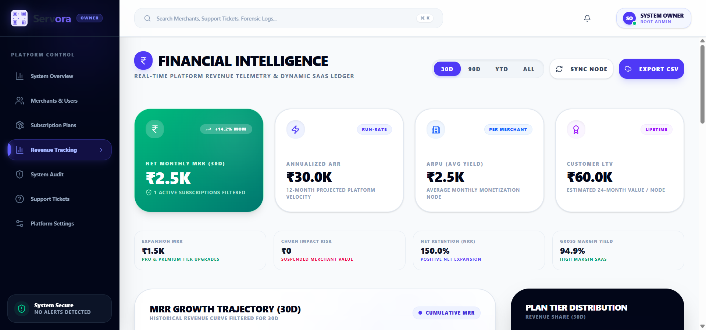
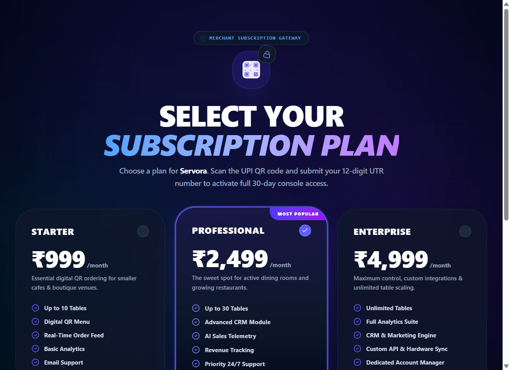
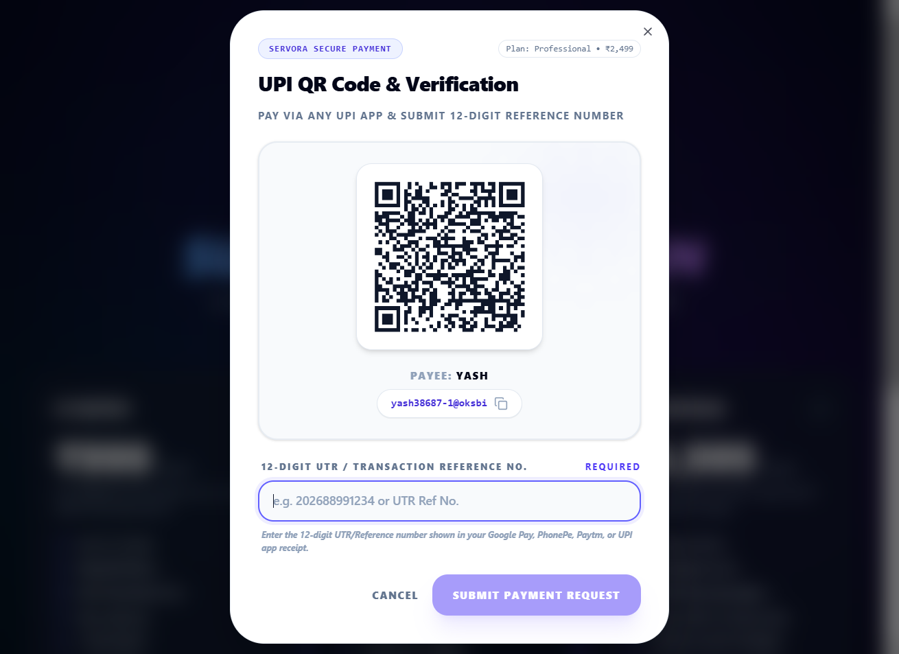
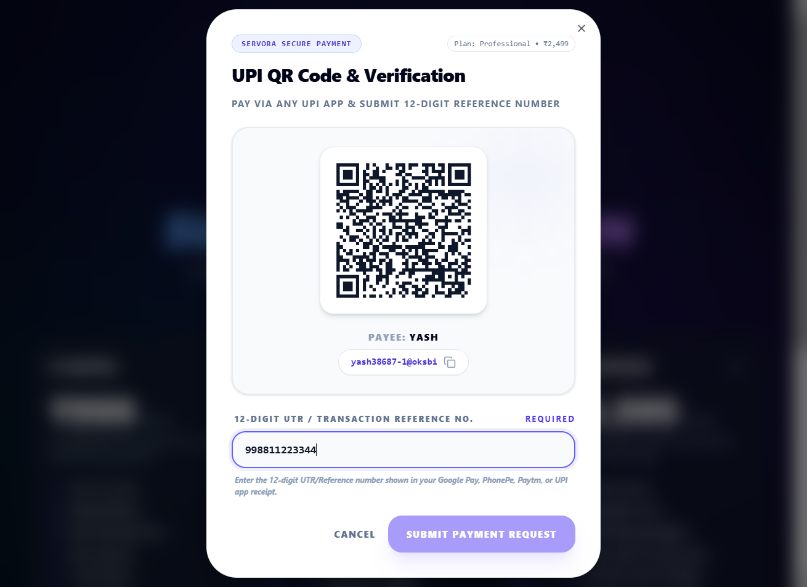
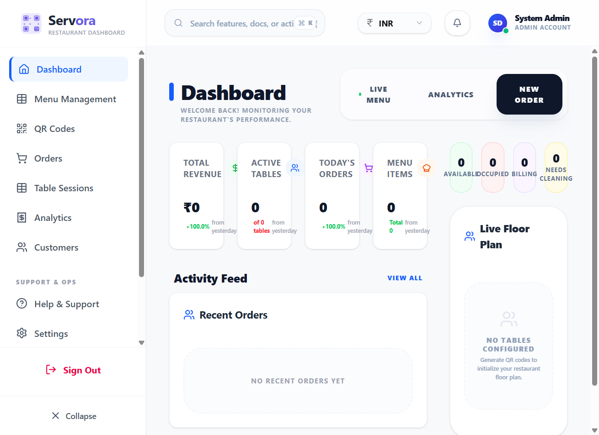

# FoodieTech - Restaurant Management System

A modern, feature-rich restaurant management system built with React, Vite, and Tailwind CSS. FoodieTech provides a complete solution for restaurants to manage menus, orders, and customer experiences seamlessly.

## 🚀 Features

### Customer Experience
- **Digital Menu**: Interactive menu with categories, search, and real-time filtering
- **Mobile-First Design**: Responsive design optimized for all devices
- **Draggable Cart Button**: Innovative draggable floating cart for mobile users
- **Order Tracking**: Real-time order status tracking with detailed timeline
- **QR Code Integration**: Easy table-based ordering with QR codes

### Restaurant Management
- **Menu Management**: Add, edit, and categorize menu items
- **Order Management**: Complete order lifecycle from placement to completion
- **Table Management**: Assign and manage restaurant tables
- **Order History**: Comprehensive order tracking with timestamps
- **Real-time Updates**: Live order status synchronization

### Technical Features
- **Modern UI**: Built with shadcn/ui components for professional appearance
- **Smooth Animations**: Framer Motion for fluid user interactions
- **State Management**: Efficient React state management with hooks
- **Local Storage**: Persistent data storage for menu items and orders
- **Error Handling**: Comprehensive error boundaries and user feedback

## 🛠️ Tech Stack

- **Frontend**: React 18 with Vite
- **Styling**: Tailwind CSS + shadcn/ui components
- **Animations**: Framer Motion
- **Icons**: Lucide React
- **Build Tool**: Vite
- **Package Manager**: npm

## 📱 Responsive Design

FoodieTech is fully responsive with optimized experiences for:
- **Mobile**: Touch-friendly interface with draggable cart
- **Tablet**: Adaptive layouts for medium screens
- **Desktop**: Full-featured management dashboard

## 🏗️ Project Structure

```
client/
├── src/
│   ├── components/
│   │   ├── ui/           # Reusable UI components
│   │   ├── order/        # Order-related components
│   │   └── dashboard/    # Dashboard components
│   ├── pages/
│   │   └── CustomerMenu.jsx    # Main customer interface
│   ├── hooks/
│   │   └── useOrderManagement.js  # Order management logic
│   ├── services/
│   │   └── menuService.js        # Menu API service
│   └── App.jsx              # Main application component
```

## 🚀 Getting Started

### Prerequisites
- Node.js 16+ 
- npm or yarn

### Installation

1. Clone the repository
```bash
git clone <repository-url>
cd foodie-tech/client
```

2. Install dependencies
```bash
npm install
```

3. Start the development server
```bash
npm run dev
```

4. Open your browser and navigate to `http://localhost:5173`

### Build for Production
```bash
npm run build
```

## 📋 Usage

### For Customers
1. Scan QR code at restaurant table
2. Browse the interactive menu
3. Add items to cart using draggable cart button
4. Place order and track real-time status

### For Restaurant Staff
1. Access dashboard to manage menu items
2. Monitor and process incoming orders
3. Update order status in real-time
## 📸 Application Screenshots & Live Demos

### 1. Admin Financial Intelligence & Platform Control


### 2. Merchant Subscription Gateway


### 3. UPI QR Code & Instant UTR Verification Modal


### 4. Real-Time Payment Verification Pending State


### 5. Unlocked Active Merchant Console Dashboard


## 🎯 Key Features Highlight

### Draggable Cart Button
- Innovative mobile cart that can be repositioned
- Smooth drag functionality with boundary constraints
- Visual feedback during interactions

### Order Tracking System
- Real-time order status updates
- Detailed timeline with timestamps
- Automatic session management

### Professional UI
- Modern design with shadcn/ui components
- Smooth animations and transitions
- Consistent color scheme and typography

## 🔧 Configuration

### Environment Variables
Create a `.env` file in the root directory:
```env
VITE_API_URL=http://localhost:3000
VITE_RESTAURANT_ID=restaurant-123
```

### Menu Data
Menu items are stored in localStorage for persistence. Add items through the dashboard interface.

## 🤝 Contributing

1. Fork the repository
2. Create a feature branch (`git checkout -b feature/AmazingFeature`)
3. Commit your changes (`git commit -m 'Add some AmazingFeature'`)
4. Push to the branch (`git push origin feature/AmazingFeature`)
5. Open a Pull Request

## 📝 License

This project is licensed under the MIT License - see the LICENSE file for details.

## 🙏 Acknowledgments

- [shadcn/ui](https://ui.shadcn.com/) for beautiful UI components
- [Tailwind CSS](https://tailwindcss.com/) for utility-first CSS framework
- [Framer Motion](https://www.framer.com/motion/) for animations
- [Lucide](https://lucide.dev/) for beautiful icons

## 📞 Support

For support and questions:
- Email: info@foodietech.com
- Documentation: [Wiki](https://github.com/username/foodie-tech/wiki)
- Issues: [GitHub Issues](https://github.com/username/foodie-tech/issues)

---

**FoodieTech** - Transforming restaurant dining experiences with technology. 🍽️✨
